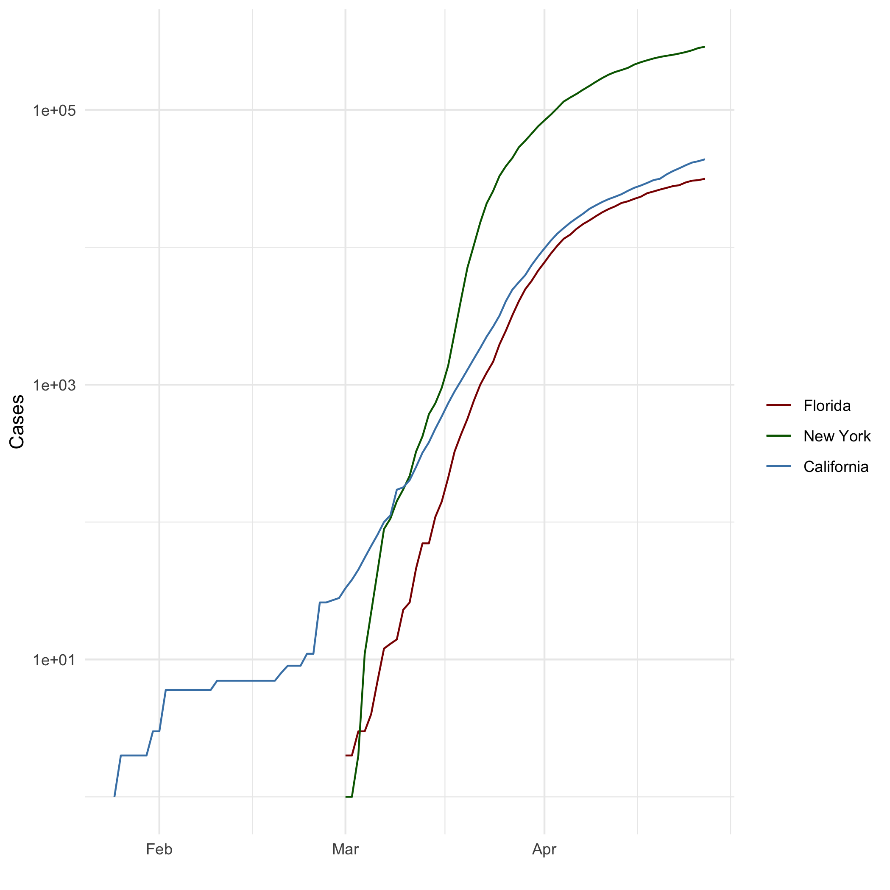

# Markdown Basics

## Favorite Foods
1. SeaFood (Shrimp/Crab)
2. Sushi (pickled or cooked)
3. Pasta 

## Images

## Add a Quote

>Hello my name is Inigo Montoya, you killed my father prepare to die.

## Add an Equation

## Add a Footnote

No six fingered men were injured during the making of this footnote.^[This is a footnote]

## Add Citations

* R for Everyone @lander2014r
* Discovering Statistics Using R @field2012discovering

# Inline Code

## NY Times COVID-19 Data

## R4DS Height vs Earnings

# Tables

## Knitr Table with Kable

## Pandoc Table

# References