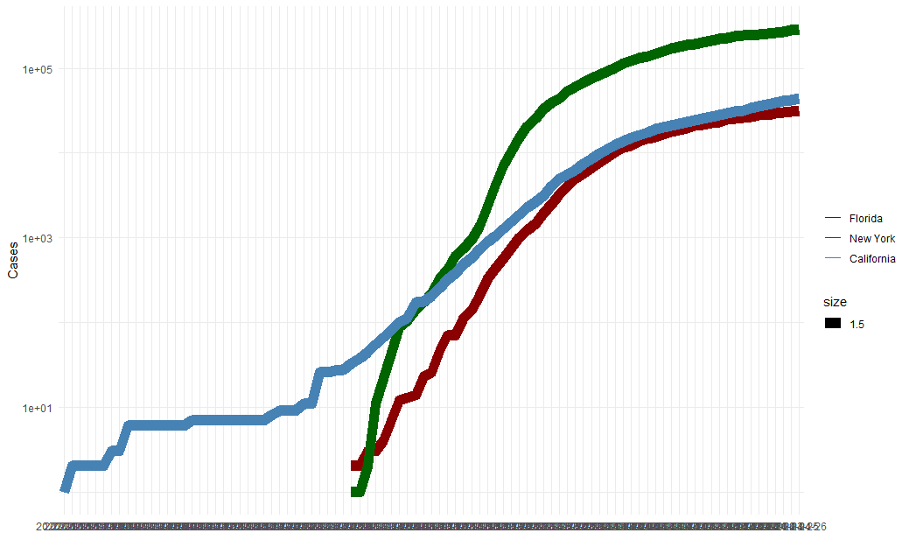

---
title: "ASSIGNMENT 4"
author: "Firstname Lastname"
date: '2010-02-14'
output:
  pdf_document: default
  html_document: default
  word_document: default
bibliography: bibliography.bib
---


# Markdown Basics

## Favorite Foods

- Pizza
- Pasta
- Burger

## Images



## Add a Quote

- “Imagination is more important than knowledge. For knowledge is limited to all we now know and understand, while imagination embraces the entire world, and all there ever will be to know and understand.” - Albert Einstein

## Add an Equation

$$

E=mc^2

$$

## Add a Footnote

R Markdown is pretty cool

## Add Citations

* R for Everyone (Jared P. Lander)
* Discovering Statistics Using R (Andy Field, Jeremy Miles, Zoe Field)

# Inline Code

```{r include = FALSE}
library(ggplot2)
covid_df <- read.csv("us-states.csv")
heights_df <- read.csv("heights.csv")
california_df <- covid_df[ which( covid_df$state == "California"), ]
ny_df <- covid_df[ which(covid_df$state == "New York"), ]
florida_df <- covid_df[which(covid_df$state == "Florida"), ]
```

## NY Times COVID-19 Data

```{r echo = FALSE}
ggplot(data=florida_df, aes(x=date, group=1)) +
  geom_line(aes(y = cases, colour = "Florida", size=1.5)) +
  geom_line(data=ny_df, aes(y = cases,colour="New York", size=1.5)) +
  geom_line(data=california_df, aes(y = cases, colour="California", size=1.5)) +
  scale_colour_manual("",
                      breaks = c("Florida", "New York", "California"),
                      values = c("darkred", "darkgreen", "steelblue")) +
  xlab(" ") + ylab("Cases") + scale_y_log10()
```

## R4DS Height vs Earnings

```{r echo = FALSE}
ggplot(heights_df, aes(x=height, y=earn, col=sex)) + geom_point(shape=2) + ggtitle("Height vs. Earnings") + xlab("Height (Inches)")  + ylab("Earnings (Dollars)")
```

# Tables


```{r include = FALSE}
name <- c("Aragon", "Bilbo", "Frodo", "Galadriel", "Sam", "Gandalf", "Legolas", "Sauron", "Gollum")
name
race <- c("Men", "Hobbit", "Hobbit", "Elf", "Hobbit", "Maia", "Elf", "Maia", "Hobbit")
race
in_fellowship <- c(TRUE, FALSE, TRUE, FALSE, TRUE, TRUE, TRUE, FALSE, FALSE)
in_fellowship
ring_bearer <- c(FALSE, TRUE, TRUE, FALSE, TRUE, TRUE, FALSE, TRUE, TRUE)
ring_bearer
age <- c(88, 129, 51, 7000, 36, 2019, 2931, 7052, 589)
age

characters_df <- data.frame(name, race, in_fellowship, ring_bearer, age)
characters_df

```

## Knitr Table with Kable


```{r echo = FALSE}
library(knitr)
kable(characters_df, caption = "One Ring To Rule Them ALL")
```


## Pandoc Table

```{r echo = FALSE}
library(pander)
pandoc.table(characters_df, style = 'grid')
```


# References

- Field, A., J. Miles, and Z. Field. 2012. Discovering Statistics Using R. SAGE Publications. https://books.google.com/books?id=wd2K2zC3swIC.
- Lander, J. P. 2014. R for Everyone: Advanced Analytics and Graphics. Addison-Wesley Data and Analytics Series. Addison-Wesley. https://books.google.com/books?id=3eBVAgAAQBAJ.

